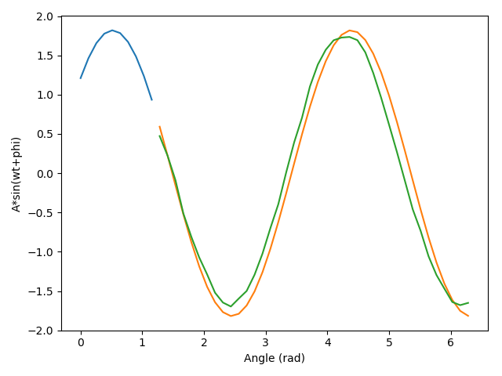
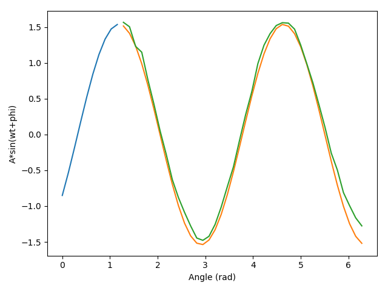
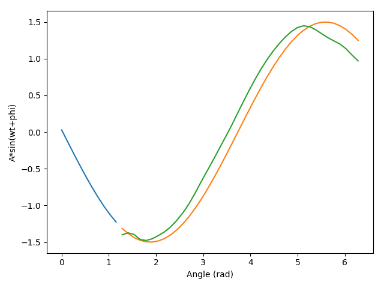
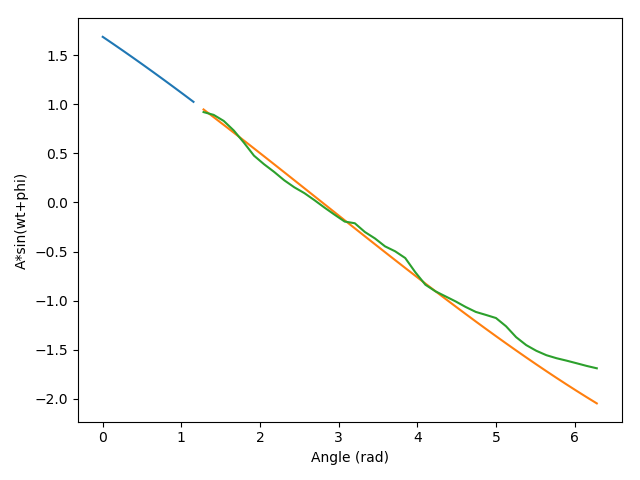

# Sine Wave Autocomplete With LSTM #

## Installation

Requirements:
- Python 3.7
- PyTorch==1.4.0
- matplotlib
- wandb

You can install all the dependencies with `pip`:

```
git clone git@github.com:JiefanYa/CNN-RNN-training.git
cd CNN-RNN-training/sine_proj
pip install -r requirements.txt
```

## Usage

Run [main.py](main.py) to train/test a model. Modify associate flags to tune hyperparameters and such.

## Results

After around 40 epochs, average loss on the test dataset reaches around 0.0803. 


<p align="center">
</img>
</img>
</img>
</img>
</p>

<p align="center">4 pieces of autocomplete output along with ground truth</p>

